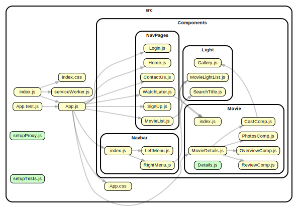
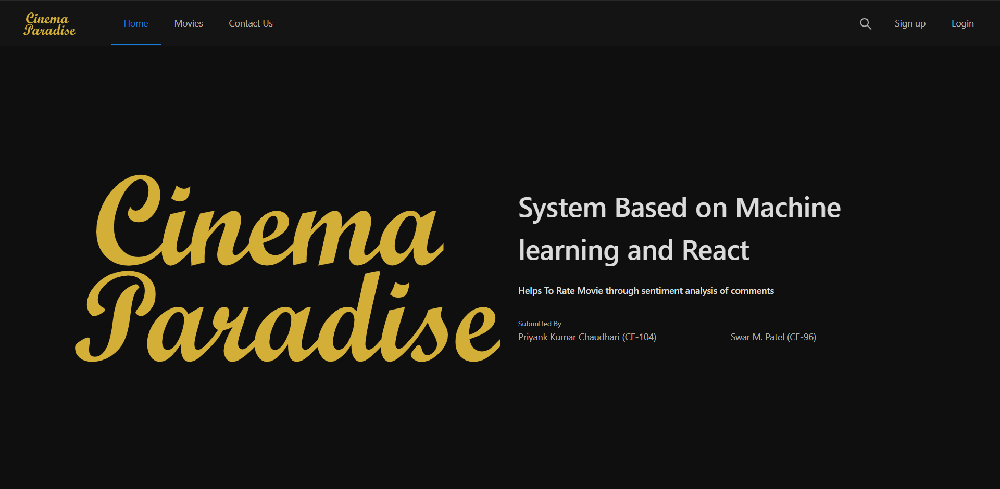
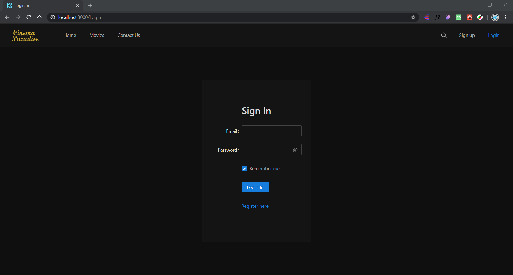
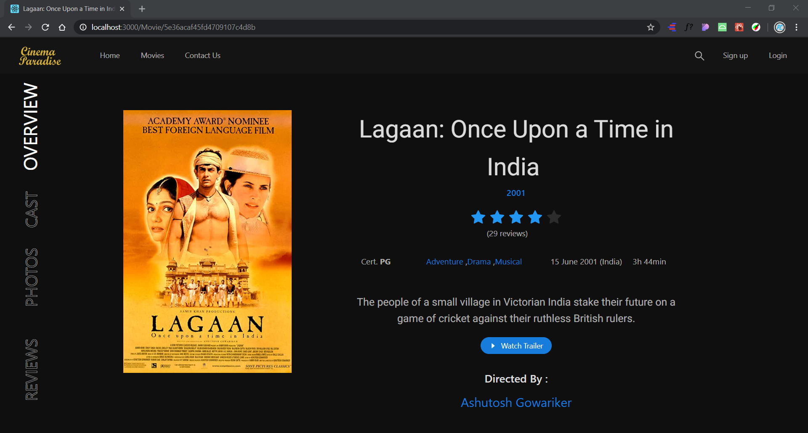
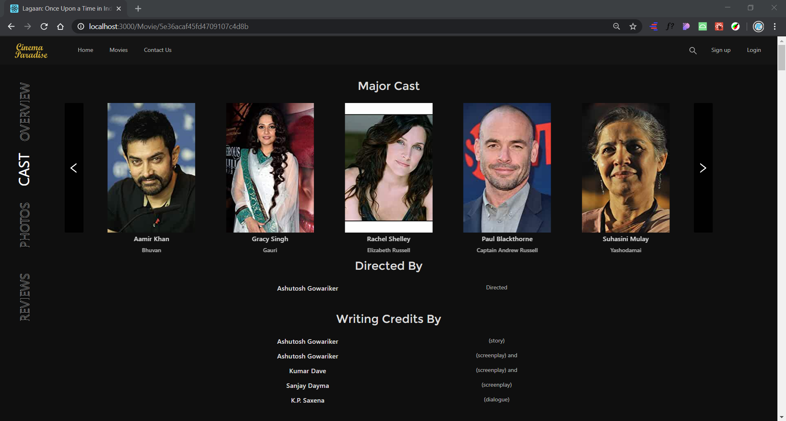
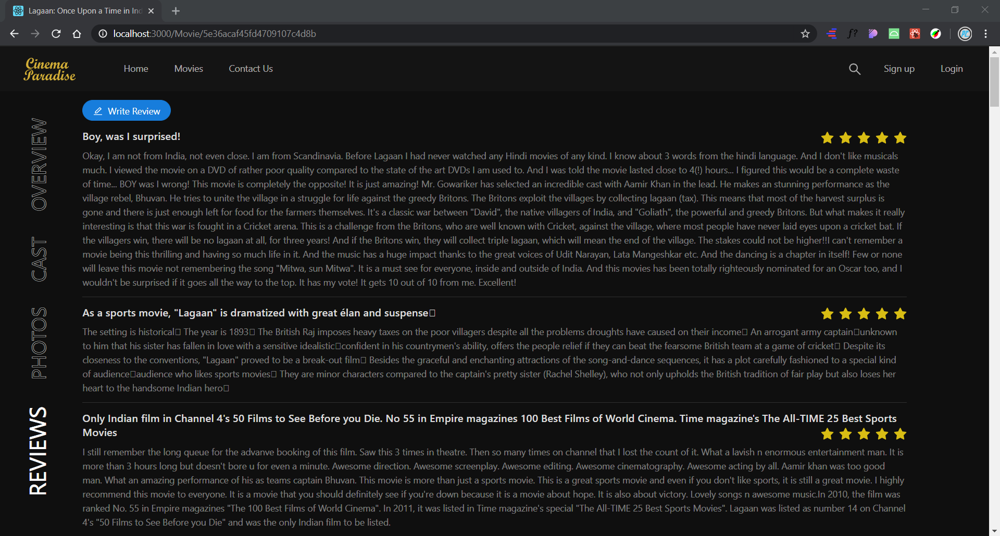
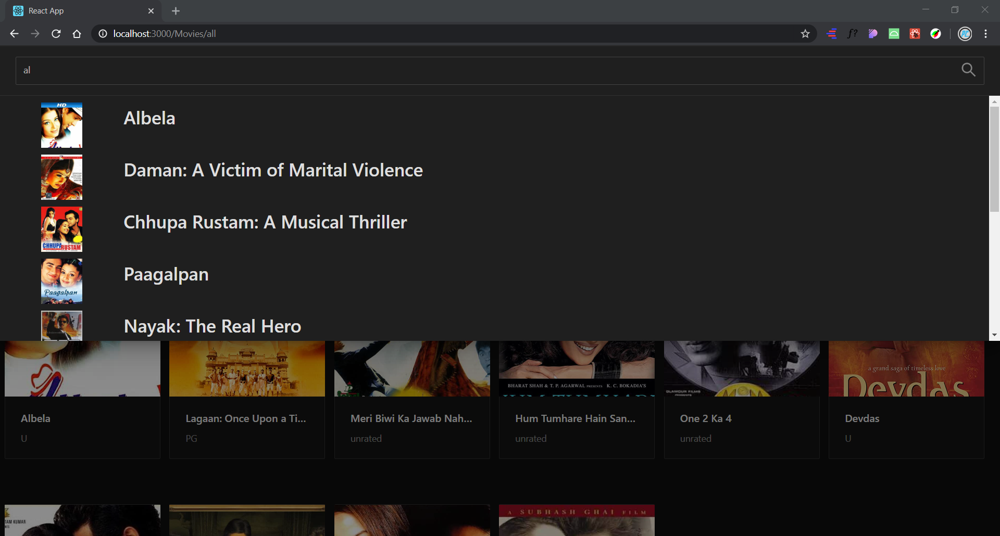
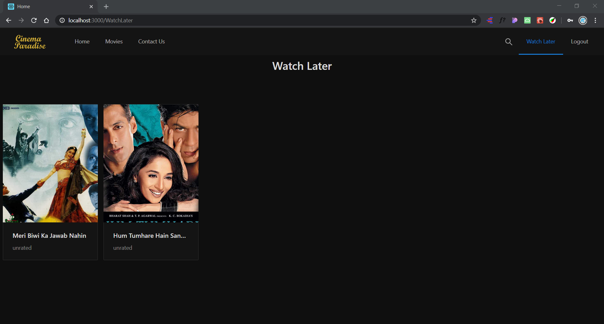

# Movie Rating System Based on Review

> We created website which uses machine learning model to predict sentiment of reviews and rates movie based on that user reviews.

### Scraping

[Imdb Movie Data, reviews and trailer link scarping](/scrape/finaldb.js) - We fetched movie data and reviews from imdb and also fetched movie trailer youtube links.

[Scarping user Reviews of movie from google](/review_model/google_review_scrape/scrape.js) - Using puppeteer library we fetched nearly 26000 reviews and we trained our model on this reviews.

#

### Preprocessing on reviews

[Review Cleaning](/review_model/cleaning/clean.js)- We used text-miner library for this.  
Steps Taken :

- Replacing emojis with "emo_pos" or "emo_neg"
- Converting to lowercase
- Removing trailing spaces
- Removing STOPWORDS
- Applying Porter Stemming

#

### Labeling of reviews

[Labeling](/review_model/cleaning/label.js) - We labeled review based on the count of number of positive words and number of negative words. You think that it's not good way of labeling but actually from 100 reviews it correctly labels 97 reviews. ( labeling of review which fetched from google which don't have star given by user.)  
For this we used Aho-Corasick String matching algorithm. which has time complexity of of O(N + L + Z) where Z is number of pattern, N is length of text and L is total number of characters in all words(patterns).

Other than this we also have reviews from imdb for which we have stars given by users to the reviews. For that reviews are labeled using stars.

- 0 - 3 stars Negative review
- 4 - 6 stars Neutral review
- 7 - 10 stars Positive review

[Movie_review_analysis](/review_model/cleaning/movie_review_analysis.json) - aftre labeling review total positive and negative count movie wise.

### Database Schema of our project

We used mongodb for database.
 
[Movie Schema](/movie-rating-app/server/models/movie.js) 
[User Schema](/movie-rating-app/server/models/user.js)

#

## Creating ML Model

#### [logistic regression](review_model/training/predict.py)  We used logistic regression with tf-idf and achieved 91% of accurracy.

#### classification report of tf-idf + logistic regression

#### [Neural network with tf-idf](/review_model/training/neuralnet.py) With Neural network and tf-idf we achieved accuracy same as logistic regression. To reduce execution time we used EarlyStopping and Dropping techniques and to improve performance we used l2 regularizer and epoch.

#### [word2vec with logistic regression and neural network](/review_model/word2vec/word2vec-sentiments.py)  We used logistic regression with word2vec and achieved 59% acccuracy. After that we applied neural network network on word2vec and got accuracy of 67%. We observed that we get less accuracy due to over-fitting on data due to less number of reviews to train on.

#### [tf-idf + word2vec with logistic regression](/review_model/word2vec/tfidf_word2vec.py) We combimed feature vector of tf-idf and word2vec and then passed it to logistic regression and achieved accuracy of 92%.

#### [Stochastic gradient descent (SGD) classifier](/review_model/training/SGDClassifier.py)  We used SGD classifier because it supports online learning which is not supported by all machine learning algorithm. only few have this online learning facility. Here when we get enough new reviews in equal range of postive and negative we train our model on this new data which is known as partial fitting. so we don't have train our model on old data again and again.we achieved same accuracy as logistic regression.

#### We also trained our model using SVM(support vector machine) algo which gives 90% accuracy.

#

## React Component Structure

#

## WebApi for ML Model

[Webapi for model](/review_model/training/api.py)  To consume our model at react side we created python flask api.

## Rating movies Based on review's sentiment script

[Movie rate script](/scrape/rateMovie.js)
  Using count of number of postive and negative reviews given stars from 1 to 10.

## For Setup Project

- Clone repo
- run `cd scrape` and run `npm install`
- test scrape file using `node finaldb.js` before that create moviedb database and create movies table otherwise script fails.
- to check frontend goto `react-app` folder and then
- run `npm install`
- run `npm run start`
- to start nodejs server go to `react-app/server` and run `node server.js`
- to check ml script go to `review_model/training` and run `python predict.py`
- to start flask api go to `review_model/training` and run `python api.py` and test using curl or postman or through react website.

## Using Docker

- frontend : `docker run -p 3000:3000 swar23/movie-react-app` and check http://localhost:3000

- review api : `docker run -p 5000:5000 swar23/reviewapp` and test using postman. 
  using post method and url : http://localhost:5000/model/predict  
  input format(json) : {"review" : "good movie ..."} 
  output format(json) : {"predict" : "1"} 
  1 - positive 0 - negative

## website Preview

### Home page  

### Sign In page  

### Explore Movies as per your convenience  

 
### Detail Movie page  

### Explore Reviews of others and make reviews 

### Quick Search Movies  
 

### Create Watch Later list  
  

- Cinema Paradise - https://infallible-shirley-baf3d7.netlify.app/  
- review api - https://flaskreviewapi.herokuapp.com/model/predict

Made By Movie Lovers ❤️ [Swar Patel](https://github.com/swarpatel23) and [Priyank Chaudhri](https://github.com/pc810).
